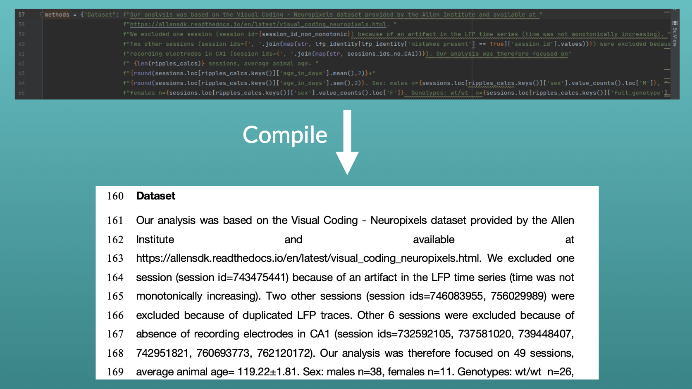

# Pyscipaper

Python tool to write a scientific paper with "end-to-end reproducibility". Each number present in the paper can be conveniently linked to a data structure via f-Strings. The output is a standard formatted word document.

Example:
 

## Requirements

https://github.com/elapouya/python-docx-template

## Usage

1. Clone this repo inside your project.
2. Update root directory in example_paper.py to reflect your folder structure.
3. Modify each section of the paper (abstract, introduction....).
4. Run example_paper.py, a formatted docx document will be  saved in the same folder.

