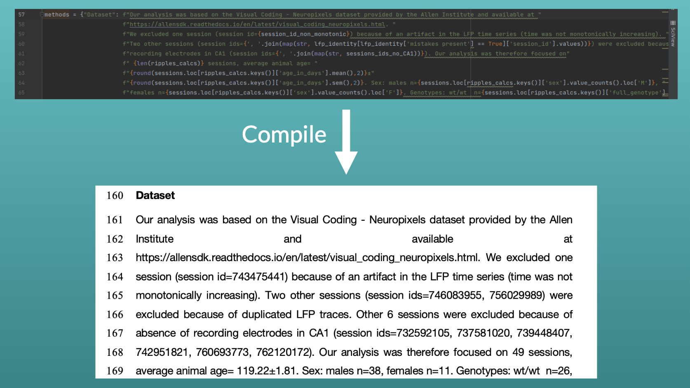

# End2EndPaper

A Python-based workflow engine designed to write scientific papers with absolute "end-to-end reproducibility." By leveraging Python f-strings, every statistical value, p-value, and numeric result in your manuscript can be directly linked to your underlying data structures. The compiled output is a completely formatted, native Microsoft Word document.



---

## Key Features

* **Data-Driven Manuscripts:** Eliminate manual copy-paste errors by injecting analysis variables straight into your text.
* **Dynamic Updating:** If your data pipeline or sample size changes, re-running the script updates every number throughout the entire document instantly.
* **Word Integration:** Outputs clean, standard styled `.docx` files ready for journal submission.
* **Math Support:** Author equations using familiar LaTeX syntax directly inside your text strings.

---

## Requirements

This tool requires the `python-docx-template` library. Install it via pip:

```bash
pip install docx-tpl
```

For more details on the template engine, visit the [python-docx-template GitHub repository](https://github.com/elapouya/python-docx-template).

---

## Getting Started

1. **Clone the Repository:** Place this repository inside your active data analysis or research project directory.
2. **Configure Directories:** Open `example_paper.py` and update the root directory paths to align with your project's local folder structure.
3. **Draft Your Manuscript:** Modify the text variables for each section of your paper (e.g., abstract, introduction, methods, results). 
4. **Compile:** Run the master script to build your paper:

```bash
python example_paper.py
```

A freshly formatted `docx` document will automatically save directly into your project folder.

---

## LaTeX and Equation Support

You can author inline math formulas natively by surrounding them with single dollar signs, like `$a^2 + b^2 = c^2$`. Because Word does not parse LaTeX natively on import, a custom VBA macro is provided to automatically transform these text strings into native Microsoft Word Equation blocks.

### Setting Up the Word Macro

1. Open your generated `.docx` document in Microsoft Word.
2. Press `Alt + F11` to open the VBA Editor.
3. Click **Insert > Module** and paste the following macro script into the editor:

```vba
Sub ConvertSingleDollarLaTeX()
    Dim rng As Range
    Dim rawText As String
    Dim objMath As Object
    
    Set rng = ActiveDocument.Content
    
    ' Enable Wildcard search for single dollar signs $(everything inside)$
    With rng.Find
        .ClearFormatting
        .Text = "\$(?*)\$"
        .MatchWildcards = True
        .Forward = True
        .Wrap = wdFindStop
        
        Do While .Execute
            ' 1. Grab the raw text including the dollar signs
            rawText = rng.Text
            
            ' 2. Strip the starting and ending dollar signs from the string
            rawText = Mid(rawText, 2, Len(rawText) - 2)
            
            ' 3. Fix the Python f-string issue by converting tabs back to \t
            rawText = Replace(rawText, vbTab, "\t")
            
            ' 4. Clear the text inside the range (removes the dollar signs entirely)
            rng.Text = ""
            
            ' 5. Add a clean native math block container at the empty range
            Dim mathRange As Range
            Set mathRange = rng.OMaths.Add(Range:=rng)
            
            ' 6. Extract the actual equation object from the range, inject text, and build up
            Set objMath = mathRange.OMaths(1)
            objMath.Range.Text = rawText
            objMath.BuildUp
            
            ' 7. Cleanly advance past this newly made equation block
            rng.Collapse wdCollapseEnd
        Loop
    End With
    
    MsgBox "All single-dollar LaTeX equations have been successfully converted without dollar signs!", vbInformation
End Sub
```

4. Close the VBA Editor and return to your Word document.
5. Press `Alt + F8`, select `ConvertSingleDollarLaTeX`, and click **Run**. All inline LaTeX markup will convert instantly into native, publication-ready Word equations.
